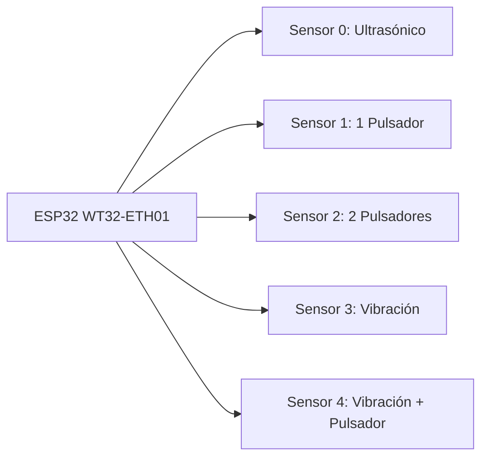
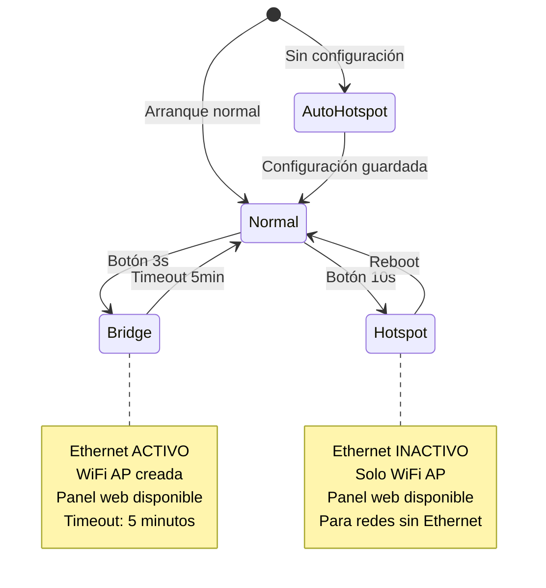

# Multi-Sensor IoT Universal - ESP32 Professional Firmware

<div align="center">


**Sistema IoT profesional para ESP32 WT32-ETH01**

Soporte multi-sensor, conectividad dual Ethernet/WiFi, configuración web y actualizaciones OTA automáticas.

[Características](#-características-principales) • [Quick Start](#-quick-start) • [Configuración](#-configuración-de-sensores) • [OTA](#-sistema-ota) • [Troubleshooting](#-troubleshooting)

</div>

---

## 📋 Tabla de Contenidos

- [Características Principales](#-características-principales)
- [Hardware Requerido](#-hardware-requerido)
- [Diagrama de Conexión](#-diagrama-de-conexión)
- [Quick Start](#-quick-start)
- [Modos de Operación](#-modos-de-operación)
- [Configuración de Sensores](#-configuración-de-sensores)
- [Panel Web](#-panel-de-configuración-web)
- [Sistema OTA](#-sistema-ota)
- [MQTT](#-mqtt)
- [Arquitectura](#-arquitectura-del-sistema)
- [Troubleshooting](#-troubleshooting)

---

## 🎯 Características Principales

### 🔗 Conectividad Avanzada

| Característica | Descripción |
|---------------|-------------|
| **Ethernet** | Conexión cableada prioritaria via WT32-ETH01 (LAN8720 PHY) |
| **WiFi** | Conexión inalámbrica como backup o principal |
| **Modo Dual** | Ethernet primario + WiFi backup con failover automático |
| **Auto-Hotspot** | Se activa automáticamente si no hay configuración previa |

### 🎛️ Multi-Sensor Universal

<div align="center">



</div>

| # | Sensor | Modelo | Rango/Función | GPIO Por Defecto |
|---|--------|--------|---------------|------------------|
| 0 | 📏 **Ultrasónico** | HC-SR04 / JSN-SR04T | 1-400 cm | TRIG: 25, ECHO: 26 |
| 1 | 🔘 **1 Pulsador** | Interruptor digital | On/Off | GPIO 13 |
| 2 | 🔘🔘 **2 Pulsadores** | Doble interruptor | Dual On/Off | GPIO 13, 14 |
| 3 | 📳 **Vibración** | SW-420 | Golpes/Vibración | GPIO 32 |
| 4 | 📳🔘 **Vibración + Pulsador** | SW-420 + Botón | Combinado | Vib: 32, Btn: 13 |

### ⚙️ Sistema Profesional

| Componente | Descripción |
|------------|-------------|
| **Panel Web** | 7 pestañas: Red, WiFi, Conexión, MQTT, Dispositivo, Sensor, Sistema |
| **OTA Automático** | Verificación cada 30 segundos con rollback protection |
| **LED Status** | 3 LEDs para diagnóstico visual (Verde/Rojo/Azul) |
| **Botón Config** | Multi-modo: 3s = bridge, 10s = hotspot |
| **Config Persistente** | Sobrevive a actualizaciones OTA (ESP32 Preferences) |
| **Logs** | Eventos del sistema guardados en memoria |

---

## 🖥️ Hardware Requerido

### Componentes Principales

| Componente | Especificación | Notas |
|------------|----------------|-------|
| **Microcontrolador** | ESP32 WT32-ETH01 | Ethernet + WiFi integrados |
| **Sensor Ultrasónico** | HC-SR04 o JSN-SR04T | Opcional, waterproof recomendado |
| **Sensor Vibración** | SW-420 | Salida digital |
| **Pulsadores** | Momentáneos | Cualquier botón táctil |
| **LEDs** | 3x LED (Verde/Rojo/Azul) | Para indicación de estado |
| **Botón Config** | Momentáneo | GPIO 12 a GND |

### Especificaciones Técnicas del WT32-ETH01

| Especificación | Valor |
|----------------|-------|
| **CPU** | Xtensa Dual-Core 32-bit LX6 @ 240MHz |
| **RAM** | 320KB |
| **Flash** | 4MB |
| **Ethernet PHY** | LAN8720 |
| **WiFi** | 802.11 b/g/n |
| **Bluetooth** | Classic + BLE 4.2 |
| **Alimentación** | 5V DC |

---

## 🔌 Diagrama de Conexión

### Mapa de Pines GPIO

```
┌─────────────────────────────────────────────────────────────────┐
│                    WT32-ETH01 PIN ASSIGNMENT                     │
├─────────────────────────────────────────────────────────────────┤
│                                                                  │
│  ETHERNET (LAN8720)                                              │
│  ├── GPIO 18: MDIO                                               │
│  ├── GPIO 23: MDC                                                │
│  ├── GPIO 16: PHY POWER                                          │
│  └── GPIO 0:  ETH CLK                                            │
│                                                                  │
│  SENSORES                                                        │
│  ├── GPIO 25: TRIG / Pulsador 1 (alternativo)                    │
│  ├── GPIO 26: ECHO  / Pulsador 2 (alternativo)                   │
│  ├── GPIO 13: Pulsador 1 (principal)                             │
│  ├── GPIO 14: Pulsador 2 (principal)                             │
│  └── GPIO 32: Sensor Vibración SW-420                            │
│                                                                  │
│  CONTROL                                                          │
│  ├── GPIO 12: Botón Config (a GND)                               │
│  ├── GPIO 2:  LED Azul (Config)                                  │
│  ├── GPIO 4:  LED Verde (Status OK)                              │
│  └── GPIO 5:  LED Rojo (Error)                                   │
│                                                                  │
│  ALIMENTACIÓN                                                     │
│  ├── VIN:   5V DC                                                │
│  ├── GND:   Tierra                                               │
│  └── 3.3V:  Salida (max 500mA)                                   │
│                                                                  │
└─────────────────────────────────────────────────────────────────┘
```

### Diagrama de Conexión de Sensores

#### Sensor Ultrasónico HC-SR04 / JSN-SR04T

```
ESP32 WT32-ETH01           HC-SR04 / JSN-SR04T
─────────────────         ────────────────────
      5V   ───────────────► VCC
     GND   ───────────────► GND
    GPIO 25 ──────────────► TRIG
    GPIO 26 ──────────────► ECHO
```

#### Sensor de Vibración SW-420

```
ESP32 WT32-ETH01           SW-420
─────────────────         ───────
     3.3V  ───────────────► VCC
     GND   ───────────────► GND
    GPIO 32 ──────────────► OUT (Digital)
```

#### Pulsadores

```
ESP32 WT32-ETH01           Pulsador
─────────────────         ─────────
     GND   ───────────────┐
                           │
    GPIO X ───[10kΩ]──────┘──┐
                                │    ┌──────┐
                               ─┴───►│      │
                                     │  SW  │
    GND ─────────────────────────────┤      │
                                     └──────┘
```

**Nota:** Los GPIO usan `INPUT_PULLUP` interno. El pulsador debe conectarse entre el GPIO y GND.

---

## 🚀 Quick Start

### 1. Instalación de Dependencias

```bash
# Clonar repositorio
git clone <repositorio>
cd tablenova

# Instalar PlatformIO (si no está instalado)
pip install platformio

# Instalar dependencias del proyecto
pio lib install
```

### 2. Compilar y Subir

```bash
# Compilar firmware
pio run

# Subir firmware (conecta el ESP32 primero)
pio run --target upload

# Subir sistema de archivos web (config.html)
pio run --target uploadfs

# Monitor serial (opcional)
pio device monitor
```

### 3. Script de Deploy Completo

```bash
# Deploy completo (limpia, compila, sube firmware + filesystem)
./deploy_all.sh
```

Este script:
1. Limpia el build anterior
2. Compila el firmware
3. Compila el filesystem (config.html)
4. Sube el firmware al ESP32
5. Sube el filesystem al ESP32

---

## 🎮 Modos de Operación

### Resumen de Modos

<div align="center">



</div>

### Modo Normal

Es el modo de operación estándar del dispositivo:

- **Ethernet**: Activo (si está configurado como primario o dual)
- **WiFi**: Activo según configuración (backup, primario o desactivado)
- **Sensores**: Leyendo y publicando a MQTT
- **OTA**: Verificando actualizaciones cada 30 segundos

**LEDs en modo normal:**
- 🟢 **Verde** (GPIO 4): Sólido si Ethernet + MQTT conectados
- 🔴 **Rojo** (GPIO 5): Parpadeando si hay errores de conexión
- 🔵 **Azul** (GPIO 2): Apagado

### Modo Bridge (3 segundos)

**Cómo activar:** Mantener presionado el botón de configuración (GPIO 12 a GND) durante **3 segundos**.

**Características:**
- ✅ **Ethernet MANTENIDO**: El dispositivo sigue conectado por cable
- ✅ **WiFi AP creada**: "ESP32-Bridge" (contraseña: bridge123)
- ✅ **Panel web disponible**: http://192.168.4.1
- ⏱️ **Timeout**: 5 minutos de inactividad

**LEDs en modo bridge:**
- 🔵 **Azul** (GPIO 2): Sólido

**Uso recomendado:**
- Configurar el dispositivo sin perder conexión Ethernet
- Cambiar configuración de sensores
- Verificar estado del sistema en tiempo real

### Modo Hotspot (10 segundos)

**Cómo activar:** Mantener presionado el botón de configuración (GPIO 12 a GND) durante **10 segundos**.

**Características:**
- ❌ **Ethernet DESACTIVADO**
- ✅ **WiFi AP creada**: "ESP32-Hotspot" (contraseña: 12345678)
- ✅ **Panel web disponible**: http://192.168.4.1
- 🔧 **Para redes sin Ethernet**

**LEDs en modo hotspot:**
- 🔵 **Azul** (GPIO 2): Parpadeando (500ms ON, 500ms OFF)
- 🔴 **Rojo** (GPIO 5): Parpadeando sincronizado

**Uso recomendado:**
- Configuración inicial en ubicaciones sin Ethernet
- Cambio de red WiFi
- Recuperación de acceso

### Modo Auto-Hotspot

**Activación automática:** El dispositivo entra en este modo si detecta que NO hay configuración previa guardada.

**Características:**
- Se activa automáticamente en el primer arranque
- Igual que el modo hotspot manual
- Permite configuración inicial sin acceso físico

---

## 🎛️ Configuración de Sensores

### 0. Sensor Ultrasónico (HC-SR04 / JSN-SR04T)

**Uso:** Medición de distancia (1-400 cm)

**Configuración:**
```json
{
  "sensorType": 0,
  "triggerPin": 25,
  "echoPin": 26,
  "mqttTopic": "multi-sensor/iot/distance",
  "readings": 10,
  "interval": 50
}
```

**Salida MQTT:**
```json
{
  "device": "Multi-Sensor-IoT-01",
  "sensor": "ultrasonic",
  "distance": 45.2,
  "unit": "cm",
  "timestamp": "2025-02-10T18:30:00Z"
}
```

**Características:**
- Filtrado por mediana de 10 lecturas
- Rango: 1 a 400 cm
- Resolución: ~0.3 cm
- Topic MQTT configurable

### 1. Un Pulsador Digital

**Uso:** Interruptor simple (on/off)

**Configuración:**
```json
{
  "sensorType": 1,
  "button1Pin": 13,
  "button1Invert": false,
  "button1Topic": "multi-sensor/iot/button1"
}
```

**Salida MQTT:**
```json
{
  "device": "Multi-Sensor-IoT-01",
  "sensor": "button1",
  "state": 1,
  "timestamp": "2025-02-10T18:30:00Z"
}
```

**GPIO Disponibles:** 13, 14, 25, 26, 32, 33, 34, 35

**Opción de inversión:**
- `false` (default): PRESIONADO = LOW (0), SUELTO = HIGH (1)
- `true`: PRESIONADO = HIGH (1), SUELTO = LOW (0)

### 2. Dos Pulsadores Digitales

**Uso:** Doble control independiente

**Configuración:**
```json
{
  "sensorType": 2,
  "button1Pin": 13,
  "button2Pin": 14,
  "button1Invert": false,
  "button2Invert": false,
  "button1Topic": "multi-sensor/iot/button1",
  "button2Topic": "multi-sensor/iot/button2"
}
```

**Salida MQTT:**
```json
// Pulsador 1
{
  "device": "Multi-Sensor-IoT-01",
  "sensor": "button1",
  "state": 1
}

// Pulsador 2
{
  "device": "Multi-Sensor-IoT-01",
  "sensor": "button2",
  "state": 0
}
```

### 3. Sensor de Vibración (SW-420)

**Uso:** Detección de golpes o vibración continua

**Configuración:**
```json
{
  "sensorType": 3,
  "vibrationPin": 32,
  "vibrationMode": 0,
  "vibrationThreshold": 100,
  "vibrationTopic": "multi-sensor/iot/vibration"
}
```

**Modos de operación:**

| Modo | Valor | Descripción | Salida MQTT |
|------|-------|-------------|-------------|
| **GOLPE** | 0 | Solo publica 1 al detectar golpe | `{"vibration": 1}` |
| **VIBRACIÓN** | 1 | Publica 1 cuando vibra, 0 cuando para | `{"vibration": 1}` / `{"vibration": 0}` |

**Ajuste de sensibilidad:**
- El módulo SW-420 tiene un potenciómetro onboard
- Gira en sentido horario para MÁS sensibilidad
- Gira en sentido antihorario para MENOS sensibilidad

**Cooldown (vibrationThreshold):**
- Tiempo mínimo entre detecciones (ms)
- Previene spam de mensajes
- Rango: 50 - 5000 ms (default: 100)

### 4. Vibración + Pulsador (Combinado)

**Uso:** Detección de vibración Y control por botón simultáneo

**Configuración:**
```json
{
  "sensorType": 4,
  "vibrationPin": 32,
  "vibrationMode": 0,
  "vibrationThreshold": 100,
  "vibrationTopic": "multi-sensor/iot/vibration",
  "button1Pin": 13,
  "button1Invert": false,
  "button1Topic": "multi-sensor/iot/button"
}
```

**Salida MQTT:**
```json
// Vibración
{
  "device": "Multi-Sensor-IoT-01",
  "sensor": "vibration",
  "state": 1
}

// Pulsador
{
  "device": "Multi-Sensor-IoT-01",
  "sensor": "button1",
  "state": 1
}
```

**Casos de uso:**
- Máquina industrial con parada de emergencia
- Sistema de alarma con botón de test
- Monitor de vibración con control manual

---

## 🌐 Panel de Configuración Web

### Acceso al Panel

1. **Modo Bridge:** Conectar a "ESP32-Bridge" → http://192.168.4.1
2. **Modo Hotspot:** Conectar a "ESP32-Hotspot" → http://192.168.4.1

### Pestañas Disponibles

#### 1. 🌐 Red

Configuración de red Ethernet:

| Campo | Descripción | Valor por defecto |
|-------|-------------|-------------------|
| DHCP | Habilitar IP automática | ✅ Activado |
| IP Estática | Dirección IP fija | 192.168.1.100 |
| Gateway | Puerta de enlace | 192.168.1.1 |
| Mascara | Máscara de subred | 255.255.255.0 |
| DNS Primario | Servidor DNS 1 | 8.8.8.8 |
| DNS Secundario | Servidor DNS 2 | 8.8.4.4 |

#### 2. 📶 WiFi

Configuración de red WiFi:

| Campo | Descripción | Valor por defecto |
|-------|-------------|-------------------|
| Habilitar WiFi | Activar como backup | ❌ Desactivado |
| SSID WiFi | Nombre de red | (vacío) |
| Contraseña WiFi | Clave de red | (vacío) |

#### 3. 🔗 Conexión

Modo de conexión principal:

| Modo | Valor | Descripción |
|------|-------|-------------|
| **Ethernet** | 0 | Conexión cableada prioritaria |
| **WiFi** | 1 | Conexión inalámbrica únicamente |
| **Dual** | 2 | Ethernet + WiFi backup automático |

**Comportamiento del modo Dual:**
- Ethernet es la conexión primaria
- Si Ethernet falla → WiFi se activa automáticamente
- Si Ethernet se recupera → Vuelve a Ethernet

#### 4. 📡 MQTT

Configuración del broker MQTT:

| Campo | Descripción | Valor por defecto |
|-------|-------------|-------------------|
| Servidor | IP del broker | Requerido |
| Puerto | Puerto del broker | 1883 |
| Usuario | Usuario MQTT | Opcional |
| Contraseña | Contraseña MQTT | Opcional |
| Topic | Topic base | multi-sensor/iot |
| Client ID | ID del cliente | Auto-generado |
| Keep Alive | Tiempo entre pings (s) | 60 |

#### 5. 🎛️ Sensor

Configuración del tipo de sensor y parámetros específicos.

#### 6. ⚙️ Dispositivo

Configuración general del dispositivo:

| Campo | Descripción | Valor por defecto |
|-------|-------------|-------------------|
| Nombre | Nombre del dispositivo | Multi-Sensor-IoT-01 |
| Ubicación | Ubicación física | (vacío) |
| Intervalo | Tiempo entre lecturas (ms) | 50 |
| Lecturas | Número para promedio | 10 |
| Debug Mode | Habilitar logs detallados | ❌ Desactivado |

#### 7. 📊 Sistema

Información del sistema en tiempo real:

- **Versión de firmware**
- **Dirección MAC**
- **Uptime** (tiempo de funcionamiento)
- **Estado de conexiones**
- **Memoria libre**

---

## 🌐 Sistema OTA

### Arquitectura OTA

```
┌─────────────────────────────────────────────────────────────────┐
│                     SISTEMA OTA AUTOMÁTICO                       │
├─────────────────────────────────────────────────────────────────┤
│                                                                  │
│  1. CHECK (cada 30s)                                             │
│     ├── HTTP GET → version.json                                 │
│     └── Comparar versión local vs remota                        │
│                                                                  │
│  2. DOWNLOAD (si hay actualización)                              │
│     ├── HTTP GET → multi-sensor-iot-{version}.bin               │
│     ├── Verificar SHA256                                         │
│     └── Guardar en partición OTA                                │
│                                                                  │
│  3. VERIFY                                                       │
│     ├── Checksum validation                                     │
│     ├── Boot count check                                        │
│     └── Partition integrity                                     │
│                                                                  │
│  4. INSTALL                                                      │
│     ├── Set boot partition                                      │
│     └── Reboot                                                  │
│                                                                  │
│  5. ROLLBACK (si falla)                                          │
│     ├── Boot count exceeded                                     │
│     └── Revert to previous version                              │
│                                                                  │
└─────────────────────────────────────────────────────────────────┘
```

### URLs OTA

```
Servidor OTA: http://ota.boisolo.com/multi-sensor-iot/

Firmware:     http://ota.boisolo.com/multi-sensor-iot/multi-sensor-iot-{version}.bin
Versión:      http://ota.boisolo.com/multi-sensor-iot/version.json
Filesystem:   http://ota.boisolo.com/multi-sensor-iot/littlefs.bin
```

### Formato de version.json

```json
{
  "version": "1.6.17",
  "firmware_url": "http://ota.boisolo.com/multi-sensor-iot/multi-sensor-iot-1.6.17.bin",
  "filesystem_url": "http://ota.boisolo.com/multi-sensor-iot/littlefs.bin",
  "checksum": "sha256:a1b2c3d4e5f6...",
  "mandatory": false,
  "release_date": "2025-02-10",
  "changelog": "Nueva función: Sensor combinado vibración + pulsador"
}
```

### Scripts de Deploy

#### Deploy FTP con auto-incremento de versión

```bash
# Deploy automático (incrementa patch version)
./deploy_ota.py

# Esto hace:
# 1. Lee versión actual desde platformio.ini
# 2. Incrementa versión (X.Y.Z → X.Y.Z+1)
# 3. Actualiza platformio.ini y código
# 4. Compila firmware y filesystem
# 5. Sube todo al servidor OTA
# 6. Crea version.json con SHA256
```

#### Deploy local por USB

```bash
# Deploy completo por USB
./deploy_all.sh

# Esto hace:
# 1. Limpia build anterior
# 2. Compila firmware
# 3. Compila filesystem
# 4. Sube firmware por USB
# 5. Sube filesystem por USB
```

### Safety Features

| Feature | Descripción |
|---------|-------------|
| **Boot Count Protection** | Previene boot loops (máximo 10 intentos) |
| **Checksum Verification** | SHA256 de cada actualización |
| **Verify Before Apply** | Solo instala si la descarga es correcta |
| **Automatic Rollback** | Revierte si la nueva versión falla |
| **Non-mandatory Updates** | El usuario decide cuándo actualizar |

---

## 📡 MQTT

### Estructura de Topics

```
multi-sensor/iot/              ← Topic base (configurable)
├── distance                    ← Sensor ultrasónico
├── button1                     ← Pulsador 1
├── button2                     ← Pulsador 2
├── vibration                   ← Sensor vibración
├── status                      ← Estado del sistema (API)
└── system                      ← Eventos del sistema
```

### Formato de Payload

#### Sensor Ultrasónico
```json
{
  "device": "Multi-Sensor-IoT-01",
  "location": "Oficina Principal",
  "sensorType": "ultrasonic",
  "distance": 45.2,
  "unit": "cm",
  "timestamp": "2025-02-10T18:30:00Z",
  "status": "ok"
}
```

#### Pulsador
```json
{
  "device": "Multi-Sensor-IoT-01",
  "location": "Oficina Principal",
  "sensorType": "button",
  "button": 1,
  "state": 1,
  "timestamp": "2025-02-10T18:30:00Z"
}
```

#### Vibración
```json
{
  "device": "Multi-Sensor-IoT-01",
  "location": "Oficina Principal",
  "sensorType": "vibration",
  "vibration": 1,
  "mode": "golpe",
  "timestamp": "2025-02-10T18:30:00Z"
}
```

### API REST (Status Endpoint)

```
GET /api/status
```

**Respuesta:**
```json
{
  "firmware_version": "1.6.17",
  "deviceName": "Multi-Sensor-IoT-01",
  "location": "Oficina Principal",
  "sensorType": 4,
  "ethConnected": true,
  "wifiEnabled": true,
  "wifiConnected": false,
  "mqttConnected": true,
  "uptime": 3600000,
  "freeHeap": 180000,
  "dhcpEnabled": true,
  "connectionMode": 2,
  "debugMode": false
}
```

---

## 🏗️ Arquitectura del Sistema

### FreeRTOS Tasks

```
┌─────────────────────────────────────────────────────────────────┐
│                    FREE RTOS TASK LAYOUT                         │
├─────────────────────────────────────────────────────────────────┤
│                                                                  │
│  CORE 0                    CORE 1                               │
│  ──────                    ──────                               │
│                                                                  │
│  ┌──────────────────┐    ┌──────────────────┐                  │
│  │  Sensor Task     │    │   MQTT Task      │                  │
│  │  (Solo           │    │   (Gestión MQTT  │                  │
│  │   Ultrasonido)   │    │    + Reconexión) │                  │
│  │                  │    │                  │                  │
│  │  - 50ms interval │    │  - Exponential   │                  │
│  │  - Median filter │    │    backoff       │                  │
│  │  - 10 readings   │    │  - Auto-reconnect│                  │
│  └──────────────────┘    └──────────────────┘                  │
│                                  │                               │
│                          ┌────────┴────────┐                    │
│                          │   OTA Task     │                    │
│                          │   (Check       │                    │
│                          │    updates)    │                    │
│                          │                │                    │
│                          │  - 30s interval │                    │
│                          │  - HTTP download│                    │
│                          │  - SHA256 verify│                    │
│                          └────────────────┘                    │
│                                                                  │
└─────────────────────────────────────────────────────────────────┘
```

### Estado LEDs

| LED | GPIO | Color | Estado | Significado |
|-----|------|-------|--------|-------------|
| Status | 4 | 🟢 Verde | Sólido | Sistema OK (Ethernet + MQTT) |
| Error | 5 | 🔴 Rojo | Parpadeando | Error de conexión |
| Config | 2 | 🔵 Azul | Sólido | Modo Bridge |
| Config | 2 | 🔵 Azul | Parpadeando | Modo Hotspot |

### Flujo de Datos

```
┌─────────────┐    ┌─────────────┐    ┌─────────────┐    ┌─────────────┐
│   Sensor    │───►│  Lectura    │───►│   MQTT      │───►│   Broker    │
│  (Físico)   │    │  Procesada  │    │  Publish    │    │   MQTT      │
└─────────────┘    └─────────────┘    └─────────────┘    └─────────────┘
                                                                  │
                                                   ┌──────────────┴───────────┐
                                                   │                          │
                                              ┌────▼─────┐              ┌────▼─────┐
                                              │ Home     │              │ Dashboard│
                                              │ Assistant│              │  / App   │
                                              └──────────┘              └──────────┘

┌─────────────┐    ┌─────────────┐    ┌─────────────┐    ┌─────────────┐
│   Usuario   │───►│  Panel Web  │───►│   API REST  │───►│  Estado    │
│  (Navegador)│    │  192.168.4.1│    │  /api/status│    │  Sistema   │
└─────────────┘    └─────────────┘    └─────────────┘    └─────────────┘
```

---

## 🛠️ Desarrollo

### Estructura de Proyecto

```
tablenova/
├── src/
│   └── multi-sensor-iot.ino    # Firmware principal (~2500 líneas)
├── data/
│   └── config.html              # Panel web (~850 líneas)
├── scripts/
│   ├── deploy_ota.py           # Deploy OTA con auto-version
│   └── deploy_all.sh           # Deploy USB completo
├── .pio/
│   └── build/
│       └── esp32dev/
│           ├── firmware.bin    # Firmware compilado
│           └── littlefs.bin    # Filesystem compilado
├── platformio.ini              # Configuración PlatformIO
├── README.md                   # Este archivo
└── version.json                # Versión OTA (generado)
```

### Compilar para Debug

```bash
# Entorno debug con más logs
pio run -e esp32dev_debug

# Entorno release optimizado
pio run -e esp32dev
```

### Monitor Serial

```bash
# Ver logs en tiempo real
pio device monitor

# Con filtros
pio device monitor --filter esp32_exception_decoder
```

---

## 🔧 Troubleshooting

### Problemas Comunes

#### El dispositivo no conecta por Ethernet

| Síntoma | Causa Posible | Solución |
|---------|---------------|----------|
| LED rojo parpadeando | Cable desconectado | Verificar cable RJ45 |
| LED rojo parpadeando | IP incorrecta | Verificar configuración DHCP/IP estática |
| LED rojo parpadeando | Switch/AP no responde | Probar otro puerto |

#### No se puede acceder al panel web (192.168.4.1)

| Síntoma | Causa Posible | Solución |
|---------|---------------|----------|
| "No se puede cargar la página" | Filesystem no subido | Ejecutar `pio run --target uploadfs` |
| Timeout | Modo bridge no activo | Activar modo bridge (botón 3s) |
| "Conexión rechazada" | WiFi no conectado | Conectar al SSID correcto |

#### El sensor no publica datos

| Síntoma | Causa Posible | Solución |
|---------|---------------|----------|
| No hay mensajes MQTT | MQTT no conectado | Verificar broker, puerto, credenciales |
| Datos incorrectos | GPIO mal configurado | Verificar configuración de pines |
| Solo publica una vez | Modo golpe vs vibración | Cambiar modo de vibración |

#### WiFi NO_AP_FOUND (error 201)

**¿Es un error real?** NO, es normal en modo dual.

El ESP32 en modo dual:
- Usa Ethernet como conexión primaria ✅
- Intenta conectar al WiFi como backup (puede fallar) ⚠️
- El sistema sigue funcionando por Ethernet ✅

**Si quieres eliminar estos mensajes:**
1. Desactiva el WiFi backup desde el panel web
2. O cambia a modo Ethernet únicamente

### Códigos de Error WiFi

| Código | Significado | Solución |
|--------|-------------|----------|
| 201 | NO_AP_FOUND | SSID incorrecto o fuera de rango |
| 202 | AUTH_FAIL | Contraseña incorrecta |
| 203 | ASSOC_FAIL | No se puede asociar al AP |
| 204 | HANDSHAKE_TIMEOUT | Timeout en el handshake 4-way |
| 205 | CONNECTION_FAIL | Error genérico de conexión |

### Verificar Configuración Guardada

```bash
# Ver el estado completo del dispositivo
curl http://<IP-del-ESP32>/api/status

# O desde el navegador:
http://<IP-del-ESP32>/status
```

### Resetear a Fábrica

```bash
# Desde el panel web:
# 1. Entrar en pestaña "Sistema"
# 2. Click en "Resetear Configuración"
```

Esto elimina toda la configuración guardada y el dispositivo entrará en modo Auto-Hotspot.

### Logs de Depuración

Habilitar modo debug desde el panel web para ver mensajes detallados en el monitor serial:

```
DEBUG > Pulsador 1: PRESIONADO
📳 [VIBRATION] ¡GOLPE DETECTADO! (1) - Publicando a MQTT...
OTA > Versión actual: 1.6.17
OTA > Nueva versión disponible: 1.6.18
```

---

## 📄 Licencia

MIT License - Ver archivo LICENSE para detalles completos.

---

## 🤝 Contribuciones

Contribuciones bienvenidas. Por favor:

1. Fork del proyecto
2. Crear rama `feature/nueva-funcionalidad`
3. Commit con cambios descriptivos
4. Push a la rama
5. Abrir Pull Request

---

<div align="center">

**Multi-Sensor IoT Universal** v1.6.17

Sistema IoT profesional listo para producción con características avanzadas de conectividad, monitoreo y configuración.

[⬆ Volver al inicio](#-multi-sensor-iot-universal---esp32-professional-firmware)

---

*Desarrollado con ❤️ para la comunidad IoT*

</div>
